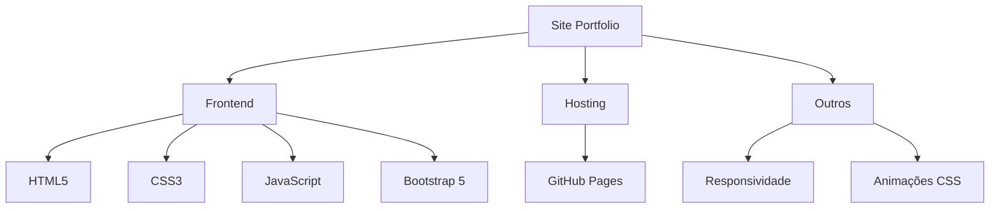
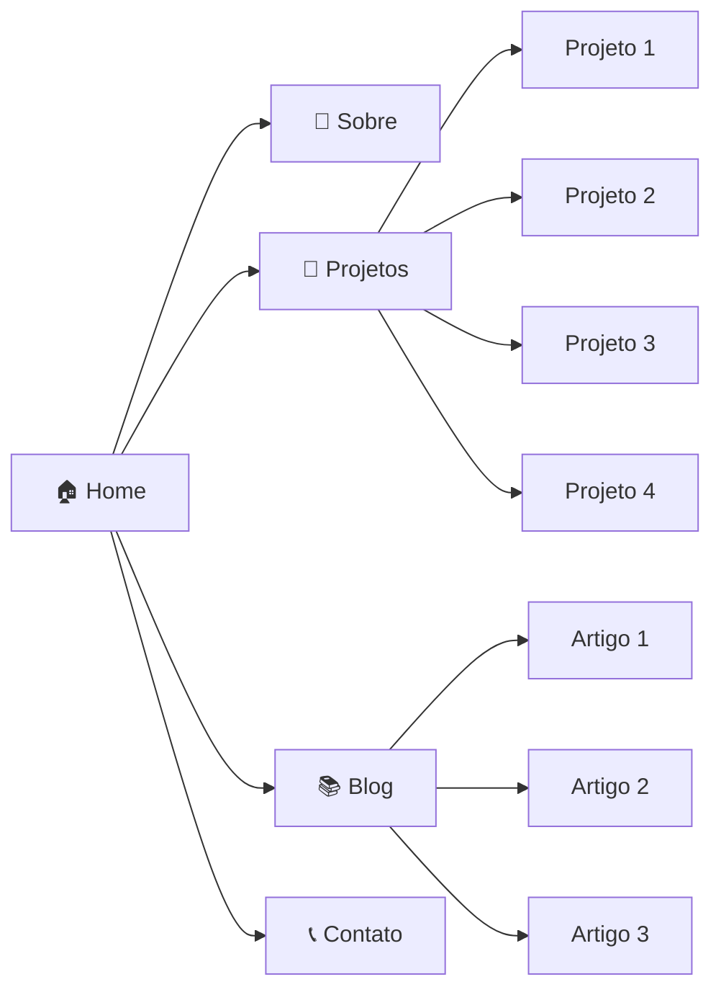

<div align="center">
  
  
  # ✨ Govinda - Portfolio & Blog Pessoal ✨

  <p>
    Site profissional e blog pessoal, mostrando projetos, habilidades e experiências.
    <br>
    <a href="https://govinda777.github.io"><strong>Visite o site »</strong></a>
  </p>

  <div>
    <a href="https://github.com/govinda777/govinda777.github.io/issues/new">Reportar bug</a>
    ·
    <a href="https://github.com/govinda777/govinda777.github.io/issues/new">Sugerir recurso</a>
  </div>
  <br>

  <!-- Badges -->
  <div>
    
    
    
    
    
    
  </div>
  <br>
  
  <!-- Tech Stack -->
  <div>
    
  </div>
  <sub><sup>HTML • CSS • JavaScript • Bootstrap 5 • GitHub Pages</sup></sub>
</div>

<br>

## 📋 Índice

- [📝 Sobre o Projeto](#-sobre-o-projeto)
- [💻 Tecnologias Utilizadas](#-tecnologias-utilizadas)
- [🎨 Características do Projeto](#-características-do-projeto)
- [🗂 Estrutura do Site](#-estrutura-do-site)
- [🚀 Como Usar](#-como-usar)
- [🔮 Roadmap](#-roadmap)
- [🤝 Contribuindo](#-contribuindo)
- [📜 Licença](#-licença)
- [📞 Contato](#-contato)

<br>

## 📝 Sobre o Projeto

<div align="center">
  
</div>

Este é meu site pessoal e profissional, projetado para servir como portfolio, blog técnico e vitrine de projetos. O site é construído com um design moderno e minimalista, focado em destacar meu trabalho e habilidades como desenvolvedor.

### 🎯 Objetivo

O principal objetivo deste site é:
- 💼 Apresentar meu perfil profissional para potenciais empregadores e clientes
- 📚 Compartilhar conhecimento através de artigos técnicos no blog
- 🖥️ Exibir projetos e trabalhos desenvolvidos
- 📬 Fornecer um meio de contato profissional

### 🎭 Público-alvo

| Grupo | Descrição | Foco |
|-------|-----------|------|
| 👔 **Recrutadores** | Empregadores potenciais | Portfolio e CV |
| 👨‍💻 **Desenvolvedores** | Colegas de profissão | Código e artigos técnicos |
| 🤝 **Clientes** | Para projetos freelance | Projetos e habilidades |
| 🧠 **Entusiastas** | Interessados em tecnologia | Conteúdo do blog |

<br>

## 💻 Tecnologias Utilizadas

<div align="center">
  


</div>

| Tecnologia | Propósito | Versão | Destaque |
|------------|-----------|--------|----------|
| **HTML5** | Estrutura semântica | - | Acessibilidade e SEO |
| **CSS3** | Estilização | - | Variáveis CSS e animações |
| **JavaScript** | Interatividade | ES6+ | Efeitos e validação |
| **Bootstrap** | Framework CSS | 5.2.1 | Componentes responsivos |
| **GitHub Pages** | Hospedagem | - | Deploy automático |

<br>

## 🎨 Características do Projeto

### 🌙 Design e Interface

<div align="center">
  <table>
    <tr>
      <td align="center"><b>🎨 Tema Dark</b></td>
      <td align="center"><b>📱 Design Responsivo</b></td>
      <td align="center"><b>✨ Animações</b></td>
      <td align="center"><b>🔤 Tipografia Dual</b></td>
    </tr>
    <tr>
      <td>Cores escuras com<br>acentos turquesa</td>
      <td>Adaptável para<br>todos dispositivos</td>
      <td>Transições suaves<br>e fade-in</td>
      <td>Roboto + Fira Code<br>para código</td>
    </tr>
  </table>
</div>

### ⚙️ Paleta de Cores

<div align="center">
  
  
  
  
</div>

### 🧩 Funcionalidades

- **📄 SPA Navigation**: Navegação suave com âncoras em página única
- **🖼️ Portfolio Interativo**: Cards de projetos com animações hover
- **📰 Blog Integrado**: Artigos técnicos com categorização
- **📝 Formulário de Contato**: Interface direta para comunicação
- **📄 Currículo**: Download do CV em formato PDF

<br>

## 🗂 Estrutura do Site

<div align="center">
  


</div>

<details>
  <summary>🏠 <b>Home</b> - Introdução pessoal e chamada para ação</summary>
  
  ```html
  <section class="hero-section" id="home">
    <div class="container">
      <p class="code-font accent-text">Olá, meu nome é</p>
      <h1 class="display-3 fw-bold">Govinda.</h1>
      <h2 class="display-4 light-text">Transformo ideias em soluções inovadoras.</h2>
    </div>
  </section>
  ```
</details>

<details>
  <summary>👤 <b>Sobre</b> - Biografia profissional e habilidades técnicas</summary>
  Apresentação pessoal, trajetória profissional, áreas de expertise e principais tecnologias dominadas.
</details>

<details>
  <summary>💼 <b>Projetos</b> - Portfolio de trabalhos realizados</summary>
  Apresentação dos projetos mais relevantes com descrições, tecnologias utilizadas e links para demos/repositórios.
</details>

<details>
  <summary>📚 <b>Blog</b> - Artigos técnicos e compartilhamento de conhecimento</summary>
  Artigos sobre desenvolvimento, tutoriais, análises de tecnologias e compartilhamento de experiências.
</details>

<details>
  <summary>📞 <b>Contato</b> - Formulário para mensagens e informações</summary>
  Formulário de contato e links para redes sociais e profissionais.
</details>

<br>

## 🚀 Como Usar

### 💻 Visualização Local

1. Clone o repositório:
   ```bash
   git clone https://github.com/govinda777/govinda777.github.io.git
   ```
2. Abra o arquivo `index.html` em qualquer navegador moderno

### 🛠️ Personalização

Para personalizar este site para seu próprio uso:

<div align="center">
  <table>
    <tr>
      <td align="center">🖼️</td>
      <td><b>Imagens</b></td>
      <td>Substitua as imagens em <code>/assets</code> com suas próprias fotos</td>
    </tr>
    <tr>
      <td align="center">📝</td>
      <td><b>Conteúdo</b></td>
      <td>Atualize o conteúdo nas seções do <code>index.html</code></td>
    </tr>
    <tr>
      <td align="center">🎨</td>
      <td><b>Cores</b></td>
      <td>Personalize a paleta de cores em <code>:root</code> no CSS</td>
    </tr>
    <tr>
      <td align="center">📂</td>
      <td><b>Projetos</b></td>
      <td>Adicione seus próprios projetos e artigos de blog</td>
    </tr>
  </table>
</div>

<br>

## 🔮 Roadmap

<div align="center">
  <table>
    <tr>
      <td><input type="checkbox"> <b>Jekyll Blog</b></td>
      <td><input type="checkbox"> <b>Tema Claro/Escuro</b></td>
    </tr>
    <tr>
      <td><input type="checkbox"> <b>Analytics</b></td>
      <td><input type="checkbox"> <b>Internacionalização</b></td>
    </tr>
    <tr>
      <td><input type="checkbox"> <b>SEO Avançado</b></td>
      <td><input type="checkbox"> <b>CMS Headless</b></td>
    </tr>
  </table>
</div>

<br>

## 🤝 Contribuindo

Contribuições são bem-vindas! Se você tem sugestões para melhorar este site, sinta-se à vontade para:

1. 🔀 Fork o projeto
2. 🔨 Criar uma branch para sua feature (`git checkout -b feature/AmazingFeature`)
3. 💾 Commit suas mudanças (`git commit -m 'Add some AmazingFeature'`)
4. 📤 Push para a branch (`git push origin feature/AmazingFeature`)
5. 🔍 Abrir um Pull Request

<br>

## 📜 Licença

<div align="center">
  
  [](LICENSE)
  
  Distribuído sob a licença MIT. Veja `LICENSE` para mais informações.
</div>

<br>

## 📞 Contato

<div align="center">
  <a href="https://linkedin.com/in/seu-linkedin">
    
  </a>
  &nbsp;&nbsp;
  <a href="https://github.com/govinda777">
    
  </a>
  &nbsp;&nbsp;
  <a href="mailto:seu-email@exemplo.com">
    
  </a>
  
  <p>Govinda - <a href="mailto:seu-email@exemplo.com">seu-email@exemplo.com</a></p>
  
  <a href="https://github.com/govinda777/govinda777.github.io">
    
  </a>
</div>

<br>

---

<div align="center">
  <sub>Desenvolvido com ❤️ por Govinda</sub>
  <br><br>
  
</div>
